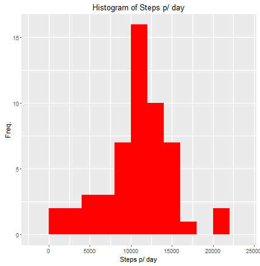

# Reproducible Research: Peer Assessment 1


##### Necessary libraries
```r
library(knitr)
library(dplyr)
library(lubridate)
library(ggplot2)

opts_chunk$set(echo = TRUE)
```

## Loading and preprocessing the data
##### 1. Load the data (i.e. read.csv())

```r
#Load the data (i.e. read.csv())
#Process/transform the data (if necessary) into a format suitable for your analysis

vfile <- "https://d396qusza40orc.cloudfront.net/repdata%2Fdata%2Factivity.zip"
vpath <- "./coursera/reproducible-research"
vpathnam <- "./data/repdata-data-activity.zip"
if(!dir.exists("data")) dir.create("data")
if(!file.exists("./data/repdata-data-activity.zip")) download.file(vfile,destfile = vpathnam,method = "auto")
if(!file.exists("./data/activity.csv"))unzip("./data/repdata-data-activity.zip",exdir = "./data")
actv <- read.csv("./data/activity.csv",header = TRUE, sep = ',', colClasses = c("numeric", "character","integer"))

# show the data with head
head(actv)
# Or show the data with str
str(actv)
}
activityData <- read.csv('activity.csv')
```
##### 2. Process/transform the data (if necessary) into a format suitable for your analysis

```r
class(actv$date)
actv$date <- ymd(actv$date)
class(actv$date)
summary(actv)
```

-----

## What is mean total number of steps taken per day?

```r
stp <- actv %>% filter(!is.na(steps)) %>% group_by(date) %>% summarize(steps = sum(steps))
head(stp)
```

##### 1. Make a histogram of the total number of steps taken each day

```r
ggplot(stp, aes(steps)) +
geom_histogram(fill = "red", binwidth = 2000) +
labs(title = "Histogram of Steps p/ day", x = "Steps p/ day", y = "Freq.")
```

 

##### 2. Calculate and report the mean and median total number of steps taken per day

```r
stpm  <- mean(stp$steps,na.rm = TRUE)
stpmd <- median(stp$steps,na.rm = TRUE)
print(stpm)
[1] 10766.19
print(stpmd)
[1] 10765
```

-----

## What is the average daily activity pattern?

```r
intv <- actv %>%  filter(!is.na(steps)) %>%  group_by(interval) %>%  summarize(steps = mean(steps))
```

##### 1. Make a time series plot

```r
ggplot(intv, aes(x=interval, y=steps)) +  geom_line(color = "red") 
```

 

##### 2. Which 5-minute interval, on average across all the days in the dataset, contains the maximum number of steps?

```r
vintv <- intv[which.max(intv$steps),]
print(vintv)
Source: local data frame [1 x 2]

  interval    steps
     (int)    (dbl)
1      835 206.1698

```

----

## Imputing missing values
##### 1. Calculate and report the total number of missing values in the dataset 

```r
sum_ms_vl <- sum(is.na(actv$steps))
print(sum_ms_vl)
[1] 2304
```


##### 2. Devise a strategy for filling in all of the missing values in the dataset.
##### 3. Create a new dataset that is equal to the original dataset but with the missing data filled in.

```r
actv_full <- actv
nas <- is.na(actv_full$steps)
avg_intv <- tapply(actv_full$steps, actv_full$interval, mean, na.rm=TRUE, simplify=TRUE)
actv_full$steps[nas] <- avg_intv[as.character(actv_full$interval[nas])]

# Check that there are no missing values:
nomsvl <- sum(is.na(actv_full$steps))
print(nomsvl)
[1] 0

stp_full <- actv_full %>%   filter(!is.na(steps)) %>%    group_by(date) %>%    summarize(steps = sum(steps))
print(stp_full)
Source: local data frame [61 x 2]

         date    steps
       (time)    (dbl)
1  2012-10-01 10766.19
2  2012-10-02   126.00
3  2012-10-03 11352.00
4  2012-10-04 12116.00
5  2012-10-05 13294.00
6  2012-10-06 15420.00
7  2012-10-07 11015.00
8  2012-10-08 10766.19
9  2012-10-09 12811.00
10 2012-10-10  9900.00
..        ...      ...

```

##### 4. Make a histogram of the total number of steps taken each day 

```r
ggplot(stp_full, aes(x = steps)) +
geom_histogram(fill = "firebrick", binwidth = 1000) +
labs(title = "Histogram of Steps p/ day, including missing values", x = "Steps p/ day", y = "Freq.")
```

 


##### ... and Calculate and report the mean and median total number of steps taken per day. 

```r
mean_actv_full <- mean(stp_full$steps, na.rm = TRUE)
median_actv_full <- median(stp_full$steps, na.rm = TRUE)
print(mean_actv_full)
[1] 10766.19
print(median_actv_full)
[1] 10766.19
```

----

## Are there differences in activity patterns between weekdays and weekends?
##### 1. Create a new factor variable in the dataset with two levels – “weekday” and “weekend” indicating whether a given date is a weekday or weekend day.


```r
# I am in Brazil, so the weekdays are in portuguese
# "Saturday" = "sabado"
# "Sunday" = "domingo"
actv_full <- mutate(actv_full, weektype = ifelse(weekdays(actv_full$date) == "sabado" | weekdays(actv_full$date) == "domingo", "weekend", "weekday"))
actv_full$weektype <- as.factor(actv_full$weektype)
head(actv_full)
```

##### 2. Make a panel plot containing a time series plot


```r
intv_full <- actv_full %>%  group_by(interval, weektype) %>%  summarise(steps = mean(steps))
pintv <- ggplot(intv_full, aes(x=interval, y=steps, color = weektype)) +  geom_line() +  facet_wrap(~weektype, ncol = 1, nrow=2)
print(pintv)
```

 
